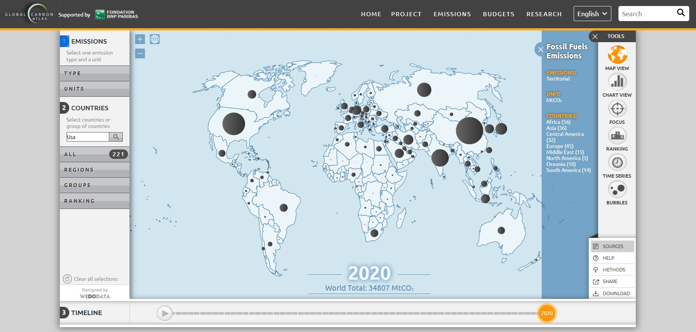
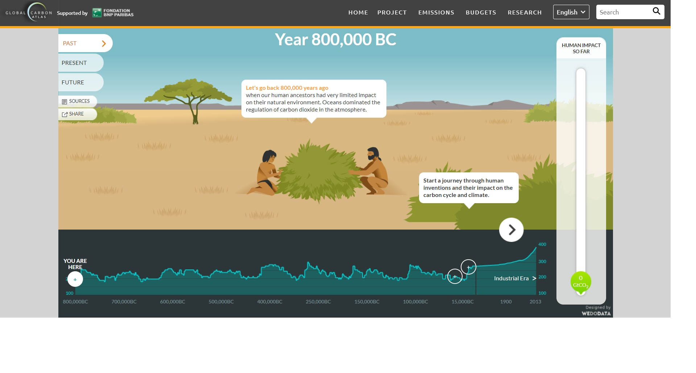
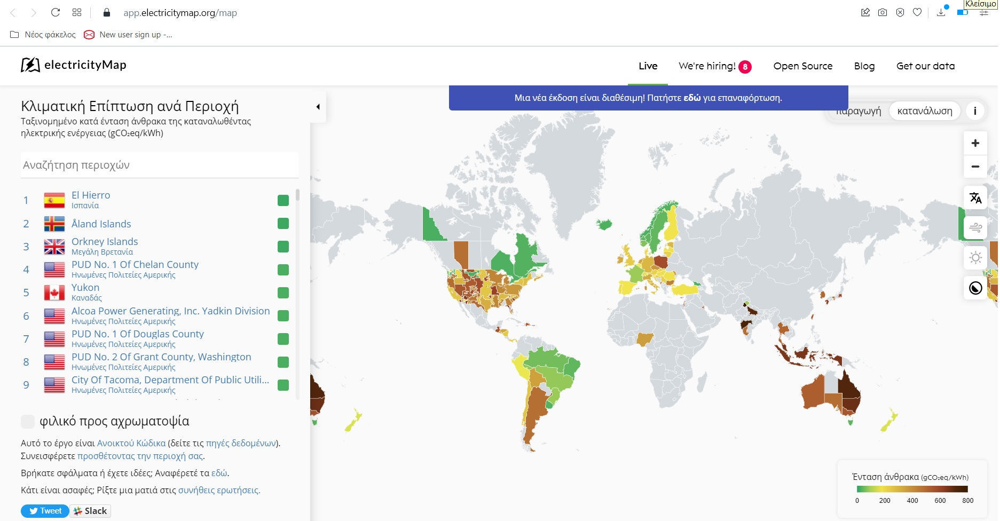
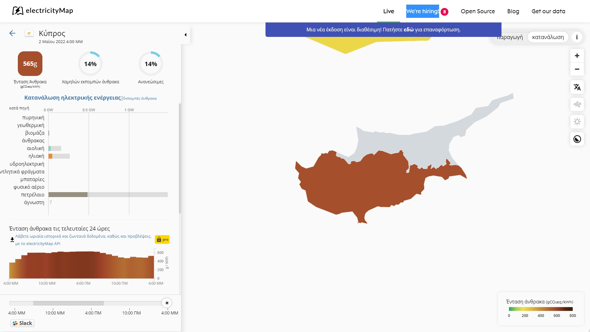
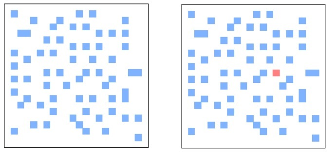
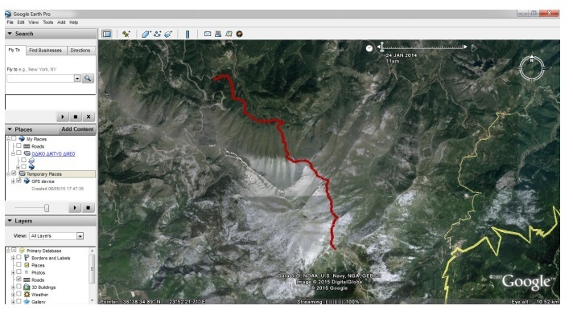
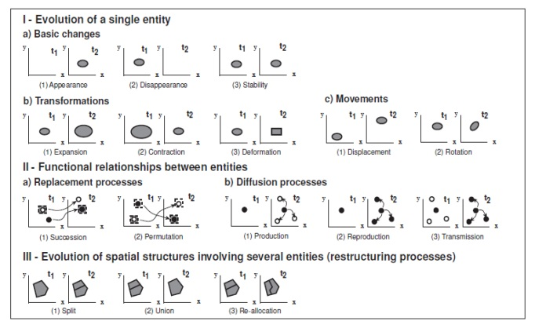

# ΓΡΑΠΤΗ ΕΡΓΑΣΙΑ 5

### ΕΛΛΗΝΙΚΟ ΑΝΟΙΚΤΟ ΠΑΝΕΠΙΣΤΗΜΙΟ, ΣΧΟΛΗ ΘΕΤΙΚΩΝ ΕΠΙΣΤΗΜΩΝ ΚΑΙ ΤΕΧΝΟΛΟΓΙΑΣ

### ΠΡΟΓΡΑΜΜΑ ΣΠΟΥΔΩΝ ΣΔΥ: «ΣΧΕΔΙΑΣΗ ΚΑΙ ΑΝΑΠΤΥΞΗ ΣΥΣΤΗΜΑΤΩΝ ΔΙΑΧΥΤΟΥ ΥΠΟΛΟΓΙΣΜΟΥ»

ΘΕΜΑΤΙΚΗ ΕΝΟΤΗΤΑ: ΣΔΥ60
ΑΚΑΔΗΜΑΪΚΟ ΕΤΟΣ: 2021-2022

## ΣΤΟΙΧΕΙA ΠΟΥ ΣΥΜΠΛΗΡΩΝΕΙ Ο ΦΟΙΤΗΤΗΣ / Η ΦΟΙΤΗΤΡΙΑ

**Η συγκεκριμένη ΓΕ αποτελεί μια προσομοίωση της τελικής εξέτασης. Ως εκ τούτου, συστήνεται να ασχοληθείτε μαζί της εντός του συγκεκριμένου χρονικού πλαισίου των 3 ωρών που θα διαρκεί και η εξέταση. Μετά την συμπλήρωση των απαντήσεων θα πρέπει να δημιουργήσετε ένα PDF και να το βάλετε στο study πριν ολοκληρωθεί ο χρόνος της εξέτασης.**

Πατήστε το κουμπί της επεξεργασίας και συμπληρώστε
https://guides.github.com/features/mastering-markdown/
τα παρακάτω στοιχεία και τις απαντήσεις στα ερωτήματα
(για μεγαλύτερη ασφάλεια να κάνετε commit τακτικά):

Ιδιωτικό αποθετήριο με τον κώδικα του ερωτήματος 4: https://github.com/FoititisEAP/ERG5

ΑΜ: 150661

Όνομα-Επώνυμο: Στυλιανός Θωμάς

Υπεύθυνη Δήλωση Φοιτητή: Βεβαιώνω ότι είμαι συγγραφέας αυτής της εργασίας και ότι κάθε βοήθεια την οποία είχα για την προετοιμασία αυτής της εργασίας, είναι πλήρως αναγνωρισμένη και αναφέρεται είτε στο σημείο «Σχόλια προς καθηγητή» είτε μέσα στην εργασία. Επίσης, έχω αναφέρει τυχόν πηγές από τις οποίες έκανα χρήση δεδομένων, ιδεών ή στοιχείων, είτε αυτά αναφέρονται ακριβώς είτε παραφρασμένα. Επίσης, βεβαιώνω ότι η εργασία αυτή προετοιμάστηκε από εμένα προσωπικά ειδικά για τη συγκεκριμένη Θεματική Ενότητα.

-[x] Συμφωνώ και αποδέχομαι την ανωτέρω δήλωση

-[] Δε συμφωνώ και δεν αποδέχομαι την ανωτέρω δήλωση (στην περίπτωση αυτή, ο Κ-Σ έχει δικαίωμα να μην αξιολογήσει την εργασία του φοιτητή)

## Ερωτήματα

Σε αυτό το μέρος θα γίνει η σχεδίαση του λογισμικού για μια τυπική εφαρμογή γεωγραφικού χάρτη. Ο στόχος είναι η σχεδίαση μιας εφαρμογής για την **αποτύπωση των εκπομπών CO2 ή άλλων στοιχείων παραγωγής / κατανάλωσης που επηρεάζουν το ενεργειακό προφίλ μιας περιοχής.**

### Ερώτημα 1 – Ανάλυση σχετικών εφαρμογών [20 μον.]
1. Επιλέξτε δύο τουλάχιστον οθόνες από κάθε εφαρμογή και προσπαθήστε να εξάγετε τα κριτήρια σχεδιασμού που προσπαθούν να ικανοποιήσουν.
http://www.globalcarbonatlas.org/en/CO2-emissions
https://app.electricitymap.org/map
2. Μελετήστε την αρθρογραφία στο google scholar αναφορικά με παρόμοιες-ανάλογες επιστημονικές μελέτες (απεικόνιση χωρο-χρονικών δεδομένων σε χάρτη) και παραθέστε τα σχετικά με την διάδραση συμπεράσματα από δύο άρθρα, έτσι ώστε να επιβεβαιώσετε-συμπληρώσετε την ανάλυση των εφαρμογών.

#### Απάντηση
Δώστε την απάντηση. Εάν δεν έχετε δώσει απάντηση γράψτε με κεφαλαία γράμματα,
ΔΕΝ ΑΠΑΝΤΗΘΗΚΕ Εάν εν γνώση σας δίνετε ελλιπή απάντηση γράψτε με κεφαλαία
γράμματα, ΕΛΛΙΠΗΣ ΑΠΑΝΤΗΣΗ.

**1.**

**α) Global Carbon Atlas (http://www.globalcarbonatlas.org/en/CO2-emissions)**

Η διαδικτυακή εφαρμογή Global Carbon Atlas (Εικόνα 1.1.1) - η οποία δημιουργήθηκε υπό την σκέπη του Global Carbon Project και πολλών ερευνητικών ιδρυμάτων και αυτόνομων επιστημόνων - εμφανίζει τις εκπομπές αερίων θερμοκηπίου σε διάφορες χώρες του κόσμου (εν προκειμένω 221) επάνω στον Παγκόσμιο Άτλα – σε τοπικό ή παγκόσμιο επίπεδο – που δημιουργούνται είτε φυσικά είτε λόγω της ανθρώπινης δραστηριότητας. Ο σκοπός της αφορά στο να μπορέσει η ανθρωπότητα να ανταπεξέλθει στην αλλαγή του κλίματος που προκαλείται από αυτήν και να την περιορίσει κατά το δυνατόν.
Η απεικόνιση είναι άμεσα διαθέσιμη, ενώ ο χρήστης έχει την αίσθηση ότι από την αρχική οθόνη έχει τη δυνατότητα να επιλέξει τις κυριότερες λειτουργίες.

Στο αριστερό μέρος υπάρχουν 3 διαφορετικά πλαίσια.

Στο πρώτο (“EMISSIONS”) υπάρχει η δυνατότητα επιλογής εμφάνισης των συνολικών εκπομπών ανά χώρα, αλλά και επιλογής του τύπου πηγής του αερίου (του ορυκτού, δηλαδή, καυσίμου) ανά χώρα (π.χ. πετρέλαιο, φυσικό αέριο, κλπ), επιλέγοντας το TYPE. Με τη χρήση της μπάρας κύλισης του ποντικιού (ή με τα πλήκτρα + και -), γίνεται κατά το δοκούν εστίαση σε οποιοδήποτε μέρος του Παγκόσμιου χάρτη. Με την επιλογή “UNITS”, επιλέγεται η εμφάνιση της μονάδας μέτρησης που θέλουμε (εκατομμύρια τόνοι CO2,κλπ).

Στο δεύτερο πλαίσιο (“COUNTRIES”) υπάρχει η δυνατότητα να επιλέξουμε/αναζητήσουμε εμείς συγκεκριμένη χώρα ή χώρες με διάφορους τρόπους. Είτε από ένα αναδυόμενο μενού πολλαπλών επιλογών (“ALL”), είτε από επιλέγοντας μεγάλες περιοχές της Γης (“REGIONS”), είτε ομάδες χωρών (“GROUPS”), είτε τις πρώτες 5 ή 10 ή 20 σε παγκόσμια κλίμακα χώρες με τις μεγαλύτερες εκπομπές αερίων (“RANKING”).

Υπάρχει πλήκτρο αποεπιλογής των ιδιαίτερων επιλογών που κάναμε (“Clear all selections”), με το πάτημα του οποίου επανέρχεται η αρχική προεπιλογή εμφάνισης του Άτλα.
Στο τρίτο (“TIMELINE”), μπορούμε να δούμε πώς εξελίσσονται οι εκπομπές αερίων ανάλογα με τις επιλογές που έχουμε κάνει στα δύο πρώτα τμήματα από το 1961 έως και το 2020.

Εικόνα 1.1.1

Στα δεξιά της οθόνης (“TOOLS”) υπάρχει η δυνατότητα επιλογής του τύπου απεικόνισης πληροφοριών σε/για:
α) χάρτη (“MAP VIEW” - προεπιλογή), β) γράφημα (“CHART”), γ) λεπτομερείς αναφορές ανάλογα με την επιλογή περιοχής (“FOCUS”), δ) παγκόσμια κατάταξη σε σχέση με εκπομπές αερίων (“RANKING”), ε) σύγκριση εκπομπών διαφορετικών χωρών/περιοχών ή διαφορετικών τύπων εκπομπών ανά χώρα (“TIME SERIES”), και στ) οπτικοποίηση των εκπομπών διαφορετικών χωρών στις 4 διαστάσεις (στον χωροχρόνο) και σε μορφή φούσκας (bubble). Το τελευταίο γίνεται επιλέγοντας: α) έως 15 χώρες/ή ομάδες χωρών, β) το μέγεθος της φούσκας, γ) τις εκπομπές που φαίνονται στους άξονες 1 και 2. Πατάμε το πλήκτρο “Play” και βλέπουμε ανά έτος να αλλάζει η εικόνα αναλόγως. Μπορούμε να σταματήσουμε ανά πάσα στιγμή ή να μετακινηθούμε σε ένα έτος. Οι φούσκες μπορούν να εμφανίζουν είτε τον πληθυσμό είτε το Ακαθάριστο εγχώριο προϊόν  (επιλογή “bubbles”).

Κάτω δεξιά στην οθόνη υπάρχουν επίσης οι επιλογές:

α) “SOURCES”, όπου φαίνονται οι πηγές των δεδομένων της εφαρμομγής,

β) Σε όποιο από τα “TOOLS” βρισκόμαστε, εάν πατήσουμε το πλήκτρο “HELP”, μας εμφανίζεται μικρή επεξήγηση για τη λειτουργία τους.

γ) “METHODS”, όπου επεξηγούνται πλήρως όλες οι πληροφορίες που αναφέρονται στην εφαρμογή.

δ) “SHARE”. Με αυτή την επιλογή, μπορεί να γίνει διαμοιρασμός/κοινοποίηση της ιστοσελίδας.

ε) “DOWNLOAD”, από όπου μπορεί ο επισκέπτης της ιστοσελίδας – αφού επιλέξει τη χρονική περίοδο που τον ενδιαφέρει - να κατεβάσει:

    - το σύνολο των δεδομένων του συστήματος σε μορφή csv ή xls, και
    - τον χάρτη σε μορφή pdf ή jpg

Στο επάνω-δεξί μέρος υπάρχουν οι επιλογές/ενότητες:
    - HOME
Ο χρήστης έχει ανά πάσα στιγμή τη δυνατότητα να επιστρέψει στην αρχική σελίδα..

- PROJECT
      Αν ο χρήστης θέλει να δει κάποιες πληροφορίες για το έργο, οι επιλογές είναι οι εξής:

Α) Overview. Αναφέρεται μία σύνοψη του συστήματος των στοιχείων/δυνατοτήτων του συστήματος.

Μία ενδιαφέρουσα επιλογή είναι η “OUTREACH” (Εικόνα 1.1.2). Από εκεί, μπορεί κανείς να περιηγηθεί σε ένα εικονικό περιβάλλον, στο οποίο με γραφικό τρόπο μπορούν κατ’ επιλογή να παρουσιάζεται:

α) η “ιστορία” των εκπομπών αερίων θερμοκηπίου (από το 800.000 π.Χ) (“PAST”). Υπάρχει η δυνατότητα μετακίνησης από εποχή σε εποχή είτε με τη χρήση των βελών είτε πληκτρολογώντας επάνω σε κατάλληλα σημεία επί του γραφήματος στο κάτω μέρος της οθόνης. Η απεικόνιση είναι ευχάριστη, λόγω της χρήσης σκίτσων. Στα δεξιά υπάρχει μία μπάρα που εμφανίζει την ανθρώπινη επιρροή στις εκπομπές CO2.

β) η παρούσα κατάσταση (“PRESENT”). Αναφέρονται πληροφορίες σχετικά με το από που προέρχονται οι εκπομπές αερίων, πώς παράγονται, που πηγαίνουν και πόση ποσότητα εκπεμπόταν κατά περιόδους.

γ) η πιθανή μελλοντική κατάσταση (“FUTURE”) ανάλογα με τις αντίστοιχες πολιτικές της ανθρωπότητας στο θέμα αυτό (μετακινώντας τη δεξιά μπάρα).

Εικόνα 1.1.2

Β) Contributors. Όλοι οι ερευνητικοί παράγοντες που συνεισέφεραν για να δημιουργηθεί η παρούσα εφαρμογή.

Γ) Contact. Στοιχεία επικοινωνίας με τους δημιουργούς.

Δ) Publications.

Ε) How to cite.

Εδώ μπορεί κανείς να δει και ένα βίντεο στην αγγλική και ένα στη γαλλική γλώσσα, στο οποίο παρουσιάζεται συνοπτικά η εφαρμογή.
      
      
- EMISSIONS
Είναι ένα εργαλείο για την αναζήτηση, εμφάνιση και κατέβασμα δεδομένων και εικόνων των εκπομπών CO2 από την καύση ορυκτών καυσίμων, την παραγωγή τσιμέντου και την αλλαγή χρήσης του περιβάλλοντος κατά την παρέλευση διάφορων δεκαετιών, και αφορά διάφορες περιοχές της Γης. Τα αποτελέσματα μπορεί να είναι συγκριτικά, διαβαθμισμένα και οι αλλαγές να φαίνονται οπτικοποιήσιμες με την πάροδο του χρόνου.

- BUDGETS
Παγκόσμιος προϋπολογισμός εκπομπών CO2 (την περίοδο 2010-2019) ή CH4 (την περίοδο 2008-2017).

- RESEARCH
Παρέχει εργαλεία για τη δημιουργία προσαρμοσμένων χαρτών και χρονικές σειρές της ροής άνθρακα από ερευνητικές πηγές. Αυτό το στοιχείο μπορεί να εξελίξει τη διεθνή ερευνητική συνεργασία σε σχέση με τη λειτουργία του κύκλου του άνθρακα και τη διάδρασή του με το κλίμα.

- SEARCH
Επιλογή αναζήτησης όρων.

**β) electricityMap (https://app.electricitymap.org/map - Χαρτογράφηση των κλιματικών επιπτώσεων της ηλεκτρικής ενέργειας**

Ο χρήστης έχει τη δυνατότητα να δει στον Παγκόσμιο Άτλα (Εικόνα 1.1.3) εστιάζοντας σε περιοχή που τον ενδιαφέρει, τρία στοιχεία περί των κλιματικών επιπτώσεων της ηλεκτρικής ενέργειας:
α) την ένταση του άνθρακα σε γραμμάρια,
β) το ποσοστό χαμηλών εκπομπών άνθρακα, και
γ) το ποσοστό χρήσης των ανανεώσιμων πηγών ενέργειας.

Εικόνα 1.1.3

Στο αριστερό μέρος της οθόνης, υπάρχει χώρος στον οποίο φαίνεται μία ταξινόμηση της Κλιματικής Επίπτωσης ανά Περιοχή κατά ένταση άνθρακα της καταναλωθέντας ηλεκτρικής ενέργειας (gCO₂eq/kWh). Μπορεί να βρει κανείς – για τις χώρες για τις οποίες υπάρχουν στοιχεία – την κατάταξή της πληκτρολογώντας το όνομά της στην “Αναζήτηση περιοχών”. Η Κύπρος (το ελεύθερο τμήμα της), για παράδειγμα, βρίσκεται στην θέση 133 παγκοσμίως (για το κατεχόμενο τμήμα της δεν υπάρχουν στοιχεία) (βλ. Εικόνα 1.1.4), ενώ για την Ελλάδα δεν υπάρχουν κάποια στοιχεία. Ακόμη, η Ελλάδα εμφανίζεται να έχει ως μία και μόνη περιοχική υποδιαίρεση τα “νησιά Αιγαίου πελάγους”.

Εικόνα 1.1.4

Υπάρχουν και οι λεγόμενες “διασυνοριακές εξαγωγές”, οι οποίες φαίνονται με τρία βέλη στα σύνορα δύο χωρών. Έτσι, π.χ. η Βουλγαρία εξάγει στην Ελλάδα 286 MW με ένταση άνθρακα εξαγωγής 447 gCO2eq/kWh, ενώ η Ελλάδα εξάγει στην Ιταλία 242 MW με ένταση άνθρακα εξαγωγής 356 gCO2eq/kWh.
Κάνοντας κλικ σε μια χώρα για την οποία υπάρχουν δεδομένα, εμφανίζονται με γραφικό τρόπο ανάλογα με την επιλογή, η κατανάλωση ηλεκτρικής ενέργειας (σε GW) ή οι εκπομπές άνθρακα (σε τόνους ανά λεπτό), σε σχέση με το είδος της ενέργειας που χρησιμοποιείται (δηλαδή πυρηνική, γεωθερμική, βιομάζα, άνθρακας, αιολική, ηλιακή, υδροηλεκτρική, υδροαντλητικά φράγματα, μπαταρίες, φυσικό αέριο, πετρέλαιο, άγνωστη). Επίσης, φαίνονται οι εκπομπές, η προέλευσή τους και οι τιμές της ηλεκτρικής ενέργειας τις τελευταίες 24 ώρες (έχοντας τη δυνατότητα κανείς να δει τα στοιχεία σε μία συγκεκριμένη χρονική στιγμή), όπως και οι πηγή/-ές των δεδομένων αυτών.
Κάνοντας κλικ σε μια χώρα για την οποία δεν υπάρχουν δεδομένα, εμφανίζεται το μήνυμα “Δεν έχουμε ακόμη πληροφορίες σχετικά με αυτή την περιοχή. Θέλετε να βοηθήσετε να το διορθώσουμε; Μπορείτε να συνεισφέρετε προσθέτοντας δεδομένα περιοχής.”, παραπέμποντας στον εξής σύνδεσμο: https://github.com/tmrowco/electricitymap-contrib/wiki/Getting-started.
Κάνοντας κλικ στο βέλος επάνω-αριστερά, εξαφανίζονται τα προηγούμενα στοιχεία, μεγαλώνοντας τον Άτλα.

Στο επάνω-δεξί μέρος του χάρτη, υπάρχουν οι επιλογές “Παραγωγή” και “κατανάλωση”. Κάνουμε την πρώτη επιλογή για αν θέλουμε να λαμβάνονται υπόψιν οι εισαγωγές και οι εξαγωγές, ενώ αν δε θέλουμε, κάνουμε τη δεύτερη.
Ακριβώς από κάτω υπάρχει κλασική δυνατότητα εστίασης του χάρτη (+ και -), ενώ παράλληλα μπορεί κανείς να χρησιμοποιήσει και την μπάρα κύλισης του ποντικιού του.
Από κάτω, υπάρχει η δυνατότητα επιλογής της γλώσσας εμφάνισης του κειμένου, μέσα από έναν κατάλογο 11 γλωσσών.
Πιο κάτω, φαίνονται οι επιλογές εμφάνισης δεδομένων αέρα και ήλιου, αλλά δε φαίνεται να λειτουργούν, ενώ υπάρχει και η δυνατότητα εναλλαγής σκοτεινής εμφάνισης, το οποίο είναι αρκετά χρήσιμο από μεριάς χρήστη - για παράδειγμα - σε περιβάλλον έντονου φωτισμού.
Κάτω-δεξιά, υπάρχει το χρωματικό φάσμα ανάλογα με την ένταση άνθρακα σε gCO2eq/kWh.

Πάνω από τον χάρτη, υπάρχουν 5 επιλογές/σύνδεσμοι:
α) “Live”. Αυτή είναι και η επιλογή της αρχικής σελίδας.
β) “We're hiring!”. Σχετίζεται με εύρεση εργασίας από την εταιρεία.
γ) “Open source”. Αναφέρεται στο πώς η κοινότητα των “Ανοικτών λογισμικών” κατάφερε να δημιουργήσει αυτό το σύστημα.
δ) “Blog”. Εδώ θα βρει κανείς πληροφορίες ποικίλης θεματολογίας, είτε όσον αφορά τις επιπτώσεις της χρήσης ηλεκτρικής ενέργειας είτε όχι.
ε) “Get our data”. Αναφέρονται πληροφορίες σε σχέση με τον τρόπο αποκομιδής των δεδομένων χρήσης του συστήματος.

Προϋπόθεση για να λειτουργήσουν οι ανωτέρω εφαρμογές είναι να υπάρχει πρόσβαση στο Παγκόσμιο Διαδίκτυο και η χρήση ενός περιηγητή ιστοσελίδων. Ακόμη και με μία σύγχρονη - χαμηλής ταχύτητας - σύνδεση, η εφαρμογή δίνει την αίσθηση στον χρήστη ότι λειτουργεί “γρήγορα”.
Ως έμπειρος χρήστης διαφόρων συστημάτων, ο γράφων μπορεί να αναφέρει ότι δε φαίνεται να υπάρχει σύγχυση όσον αφορά την αναζήτηση της πληροφορίας που επιθυμεί να βρει ο χρήστης από τα σύστηματα ή την πληροφορία που εμφανίζεται στην οθόνη, και η οποία είναι πάντοτε σαφής κάθε στιγμή στην οθόνη του χρήστη.

**2. Επιστημονικές μελέτες που αφορούν την απεικόνιση χωρο-χρονικών δεδομένων σε χάρτη και παράθεση συμπερασμάτων σε σχέση με τη διάδραση.**

Όσον αφορά την απεικόνιση χωρο-χρονικών δεδομένων σε χάρτη, δύο μελέτες θα αναφερθούν κατωτέρω.

**Α)** Η πρώτη (Μπούσουλας, 2016) αναφέρει τον όρο "Οπτικοποίηση". "Είναι η οπτική αναπαράσταση δεδομένων χρησιμοποιώντας αλγορίθμους." Όταν αυτή είναι καλή, τότε ο χρήστης μπορεί εύκολα να χρησιμοποιήσει και να αντιληφθεί τα δεδομένα. Επίσης, "βοηθά στην υποσυνείδητη (ασυναίσθητη) απόκτηση από τα δεδομένα σαν μία προπαρασκευαστική διαδικασία (pre-attentive processing). Μερικά χαρακτηριστικά ακούσιας συγκέντρωσης προσοχής περιλαμβάνουν τη θέςση, τον προσανατολισμό, την κλίμακα, το χρώμα, τη φωτεινότητα και την απόχρωση." Στο κατωτέρω παράδειγμα (Εικόνα 1.2.1), η αριστερή εικόνα αποτελείται από όμοια µπλε τετράγωνα, ενώ στη δεξιά ένα µπλε τετράγωνο έχει γίνει κόκκινο. Υπάρχει μελέτη, σύμφωνα με την οποία, όταν ο χρήστης δει την εικόνα, η πληροφορία της ύπαρξης του κόκκινου τετραγώνου λαµβάνεται αµέσως, γιατί ο εγκέφαλος το επεξεργάζεται γρήγορα και µπορεί να αναγνωρίσει το διαφορετικό αντικείµενο. Έτσι, η αξία της οπτικοποίησης είναι πολύ σημαντική.

Εικόνα 1.2.1

Η οπτικοποίηση πληροφορίας εμπεριέχει τη θεωρία χρωμάτων, τη δυσδιάστατη (π.χ. διαγράµµατα γραµµικά, διαγράµµατα ράβδων, διαγράµµατα πίτας, χάρτες και πίνακες) και την τρισδιάστατη οπτικοποίηση. Εάν στη διδιάστατη απεικόνιση, προσθέτουμε χρώμα ή αλλάξουμε σχήματ και μέγεθος, τότε τα αντικείμενα/σχήματα διακρίνονται πιο εύκολα. Η τρισδιάστατη οπτικοποίηση πληροφορίας μπορεί να αποδώσει πληροφορίες υψομέτρου, αν για παράδειγμα η πηγή των δεδομένων είναι μία συσκευή GPS. Όμως, λόγω του πλήθους πληροφοριών που πιθανόν να εμφανίζονται, η λύση είναι η διάδραση του χρήστη (μετακίνηση αντικειμένων στην οθόνη για να φαίνονται υπο διάφορες οπτικές γωνίες (panning), εστίαση(zooming) και φιλτάρισμα πληροφοριών (filtering)(π.χ. επιλογή εμφάνισης των εστιατορείων σε μία περιοχή)). Γνωστό παράδειγμα αποτελεί το Google Earth(Εικόνα 1.2.2).

Εικόνα 1.2.2

**Πώς αναπαριστώνται τα χωρο-χρονικά δεδομένα.**

**α) Τι είναι ο Χρόνος.**

"Ο χρόνος εννοείται <<η ακαθόριστη και απεριόριστη κίνηση της ύπαρξης και των γεγονότων στο παρελθόν, το παρόν και το µέλλον, θεωρούµενη ως σύνολο>>. Γενικά xρόνος χαρακτηρίζεται η ακριβής µέτρηση µιας διαδικασίας από το παρελθόν στο µέλλον" (Μπούσουλας, 2016). Οι άνθρωποι αισθάνονται τον χρόνο είτε γραμμικά (η πορεία από τη γέννηση στο θάνατο) είτε κυκλικά (εναλλαγή ημέρας/νύχτας ή των εποχών). Αυτός, μπορεί να αντιστοιχιστεί σαν μία παρόμοια τέταρτη διάσταση του Χώρου (όχι όμοια). Για την απεικόνιση των χρονικών χαρακτηριστικών των χωρικών οντοτήτων, είναι απαραίτητη η χρήση Συστημάτων Γεωγραφικών Πληροφοριών (GIS), τα οποία απαιτείται να καταγράφουν τη χρονική πληροφορία, να είναι ακριβή όσον αφορά την χωρο-χρονική πληροφορία, και να είναι πιο αποτελεσματικά σε σχέση με τα ποσοτικά, παρά με τα ποιοτικά δεδομένα (η χρονική πληροφορία συνήθως περιγράφεται με λόγια).
Ένα χρονικό GIS, θα πρέπει να απαντά στα εξής τρία ερωτήματα: α) Ερώτημα μεταβολών σε ένα Αντικείμενο (μια σειρά συμβάντων μεταβάλλει την κατάστασή του. π.χ. μετακίνησή του). β) Ερώτημα μεταβολών στα Χωρικά χαρακτηριστικά του (π.χ. αλλαγή χρήσης γης). γ) Ερώτημα μεταβολών των Χρονικών Συσχετίσεων μεταξύ πολλαπλών Γεωγραφικών φαινομένων (π.χ. αλλαγή χρήσης γης εντός κάποιας απόστασης μετά από κάποιο συμβάν). Μία τυπολογία χωρο-χρονικών μεταβολών φαίνεται στην Εικόνα 1.2.3.

Εικόνα 1.2.3

Η ανάλυση των χωροχρονικών δεδομένων επιτρέπει να γίνουν μελλοντικές προβλέψεις, βάσει των υπαρχόντων δεδομένων. Χρησιμοποιούνται τα επόμενα πρότυπα για τις χωροχρονικές αλλαγές που συμβαίνουν, και αφορούν:
α) την ύπαρξη (existential changes), όπως η εμφάνιση/εξαφάνιση αντικειμένων ή σχέσεων.
β) χωρικές ιδιότητες (Changes of spatial properties), όπως η τοποθεσία, το σχήμα, το μέγεθος και ο προσανατολισμός.
γ) θεματικές ιδιότητες/χαρακτηριστικά (Changes of thematic properties).

Τα χωροχρονικά δεδομένα μπορούν να χωριστούν σε τρία κύρια συστατικά:
α) χώρος("που") (space / where), β) χρόνος("πότε") (time / when), και γ) αντικείµενα("τι") (objects / what).
Οι συσχετίσεις τους, μπορούν να απεικονιστούν ώς εξής:
α) Το "πότε" και το "τι" μας δίνει το "που", δηλαδή ποια τοποθεσία καταλαμβάνεται από συγκεκριμένα αντικείμενα μία συγκεκριμένη χρονική στιγμή.
β) Το "που" και το "τι" μας δίνει το "πότε", δηλαδή ποια χρονική στιγμή ένα/κάποια αντικείμενο/-α βρίσκεται σε μία τοποθεσία.
γ) Το "πότε" + το "που" μας δίνει το "τι", δηλαδή ποιο/-α αντικείμενο/-α βρίσκεται σε μία συγκεκριμένη τοποθεσία τη συγκεκριμένη χρονική στιγμή.
Η χωροχρονική ανάλυση αναφέρεται ως ειδική όταν επικεντρώνεται σε ένα αντικείμενο, ενώ όταν επικεντρώνεται σε πολλά, γενική. 

Μπούσουλας Γ. (2016). Δημιουργία και οπτικοποίησης χωρο-χρονικών δεδομένων από υψηλής ανάλυσης ανοιχτά τηλεπισκοπικά δεδομένα με χρήση λογισμικού ελεύθερου κώδικα. Μεταπτυχιακή εργασία. Εθνικό Μετσόβειο Πολυτεχνείο/Σχολή Αγρονόμων και Τοπογράφων Μηχανικών/Τομέας Τοπογραφίας, https://dspace.lib.ntua.gr/xmlui/bitstream/handle/123456789/44452/Bousoulas_MSc%20_Thesis.pdf?sequence=1

### Ερώτημα 2 – Σχεδιασμός της Διάδρασης [20 μον.]
Σχεδιάστε μια εφαρμογή που **συμπληρώνει ή/και βελτιώνει** τις προηγούμενες. 
1. Περιγράψτε ένα τυπικό χρήστη (περσόνα).
2. Παρουσιάστε το σενάριο χρήσης της εφαρμογής σας με έμφαση σε μια σημαντική λειτουργία για την παραπάνω περσόνα.

#### Απάντηση
Δώστε την απάντηση. Εάν δεν έχετε δώσει απάντηση γράψτε με κεφαλαία γράμματα,
ΔΕΝ ΑΠΑΝΤΗΘΗΚΕ Εάν εν γνώση σας δίνετε ελλιπή απάντηση γράψτε με κεφαλαία
γράμματα, ΕΛΛΙΠΗΣ ΑΠΑΝΤΗΣΗ.

### Ερώτημα 3 – Ενδεικτικές οθόνες [30 μονάδες]
Σχεδιάστε 3 ενδεικτικές οθόνες, με χρήση του [figma](https://www.figma.com/) ή όποιου άλλου παρόμοιου εργαλείου θέλετε, οι οποίες να περιέχουν τα ποιο σημαντικά σημεία της διάδρασης με την συσκευή χρήστη που αναπτύξατε στο σενάριο. Οι οθόνες θα πρέπει να εστιάζουν στην βασική λειτουργία της εφαρμογής και όχι σε τυπικές οθόνες εγγραφής-εισόδου. Για μια γρήγορη πρακτική εξάσκηση στην περιοχή των αρχείων-πρόχειρα θα βρείτε το Prototyping-in-Figma και μπορείτε να αντιγράψετε τα στοιχεία που θέλετε από το σχετικο [κιτ σχεδίασης κινητών εφαρμογών](https://www.figma.com/file/oaX00nloucFQsvO2qa0SQs/Mobile-UI-kit-Community?node-id=2%3A0).

#### Απάντηση
Δώστε την απάντηση. Εάν δεν έχετε δώσει απάντηση γράψτε με κεφαλαία γράμματα,
ΔΕΝ ΑΠΑΝΤΗΘΗΚΕ Εάν εν γνώση σας δίνετε ελλιπή απάντηση γράψτε με κεφαλαία
γράμματα, ΕΛΛΙΠΗΣ ΑΠΑΝΤΗΣΗ.

### Ερώτημα 4 – Υλοποίηση [30 μονάδες]
Αφού μελετήσετε τον κώδικα και κάνετε ένα ιδιωτικό fork: https://github.com/carderne/leaflet-gsheets να γίνουν οι παρακάτω μικρές αλλαγές σε λογισμικό για μια τυπική εφαρμογή (πρόσθετος κώδικας και τεκμηριώση https://leafletjs.com/SlavaUkraini/). 
1. προσθέσετε μια τοποθέσια και μια περιοχή (με τη μορφή πολυγώνου) ακόμη στον χάρτη μαζί με τις σχετικές πληροφορίες.
2. προσθέσετε τη δυνατότητα παρουσίασης επιπλέον πληροφορίας (π.χ. σε ένα πλαίσιο όπως για παράδειγμα στο https://app.electricitymap.org/map) όταν ο χρήστης κάνει mouse over ή click σε αυτήν την περιοχή.
3. προσθέστε την δυνατότητα εντοπισμού της θέσης σας.
4. προσθέσετε την δυνατότητα χωρικής επίγνωσης, έτσι ώστε μόνο οι γεωγραφικά κοντινές (σε σημείο της επιλογής σας ή στην θέση σας) πληροφορίες εμφανίζονται.

**Θα πρέπει να δημιουργήσετε ένα ιδιωτικό αποθετήριο στο οποίο θα καλέσετε την ΣΕΠ σας και να προσθέσετε το link του εδώ. Επίσης, θα πρέπει να ενημερώσετε το link με το εκτελέσιμο, το οποίο θα βρείτε στο tab-settings-github-pages.**

#### Απάντηση
Δώστε την απάντηση. Εάν δεν έχετε δώσει απάντηση γράψτε με κεφαλαία γράμματα,
ΔΕΝ ΑΠΑΝΤΗΘΗΚΕ Εάν εν γνώση σας δίνετε ελλιπή απάντηση γράψτε με κεφαλαία
γράμματα, ΕΛΛΙΠΗΣ ΑΠΑΝΤΗΣΗ.

